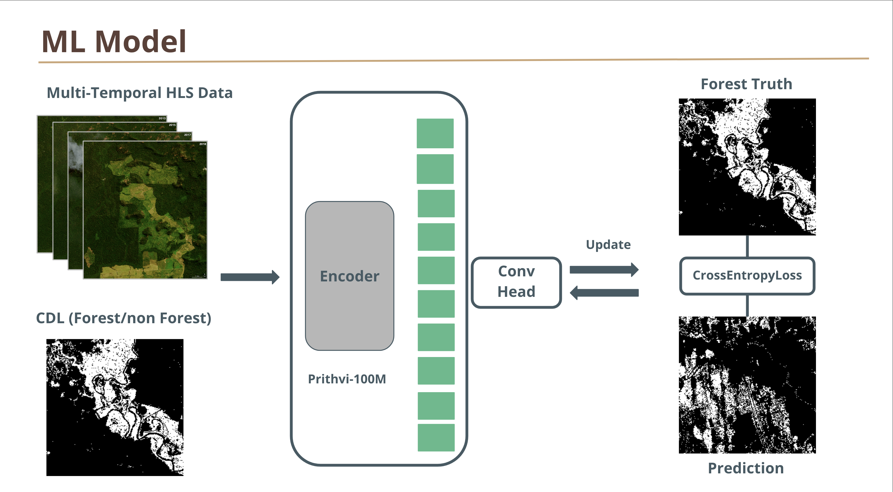

# Green Eye Forest Monitoring System

Welcome to the main repository for the "Green Eye" project! This platform is designed to monitor global forest changes in real-time, leveraging state-of-the-art AI tools and satellite datasets. Our project detects, evaluates, and predicts forest landscape anomalies, facilitating swift interventions for forest conservation.

## Table of Contents

- [Model Configuration](#model-configuration)
- [Repositories](#repositories)
- [Getting Started](#getting-started)

## Model Configuration

Our model utilizes the following configurations:

- **Data Source**: Continental US Harmonised Landsat Sentinel 2 (HLS) data.
- **Secondary Data Source**: Pre-processed CDL (Cropland Data Layer) dataset, distinguishing between forest and non-forest classes.
- **AI Tool**: NASA's and IBM's pre-trained temporal vision transformer.



For detailed model architecture and configurations, please refer to the `model_config.md` file in the repository.

## Repositories

- **APP Repo(UI)**: [Green Eye UI Repository](https://github.com/Ephemeris-NASA/GEO-UI)
- **Tools Repo**: [Green Eye Tools Repository](https://github.com/Ephemeris-NASA/geo-tools)
- **Change Analysis**: [Change Analysis Repository](https://github.com/Ephemeris-NASA/geo-picture-diff)

## Getting Started

1. **Clone the Repository**:
   ```bash
   git clone https://github.com/green-eye/main-repo.git
   ```
2. **Setup Dataset**:
   We utilize the [multi-temporal crop classification dataset](https://huggingface.co/datasets/ibm-nasa-geospatial/multi-temporal-crop-classification) available on HuggingFace for this project.

   - Download and set up the dataset by following the instructions on its HuggingFace page.

3. **Data Transformation (From 12 classes to 2 classes)**:
   With the utilities from our [Tools Repository](https://github.com/green-eye/tools-repo), transform the 12-class geotiff files to 2 classes, representing forest and non-forest.

4. **Setup and Train Model**:
   For setting up the environment and training the model, adhere to the instructions detailed in the [NASA-IMPACT's hls-foundation-os repository](https://github.com/NASA-IMPACT/hls-foundation-os/tree/main). Follow the steps provided there to finalize the environment setup and initiate the training process for our model.
